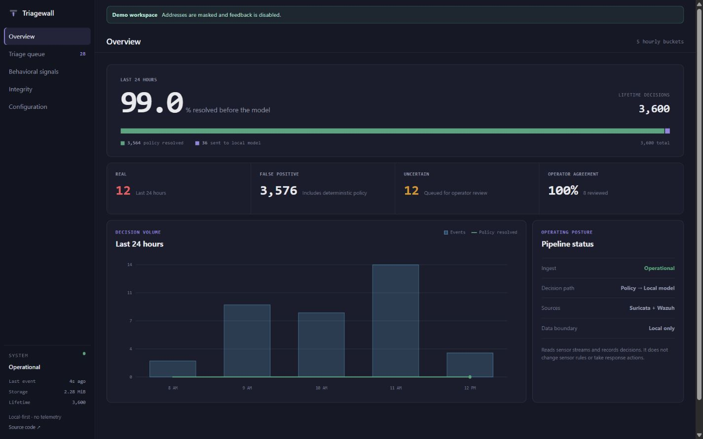
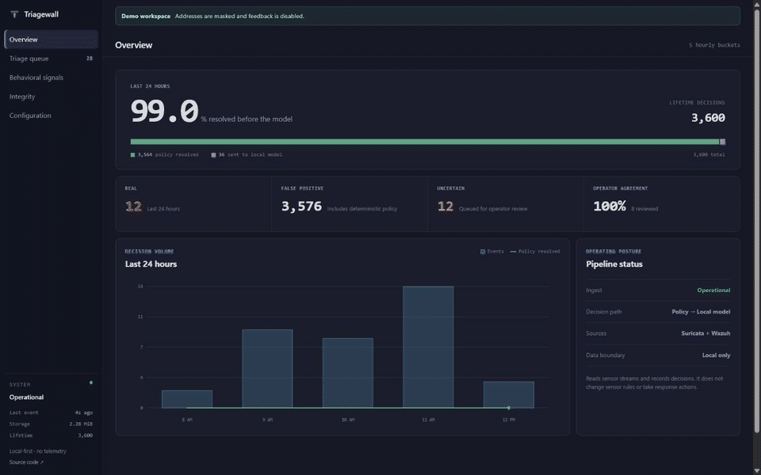
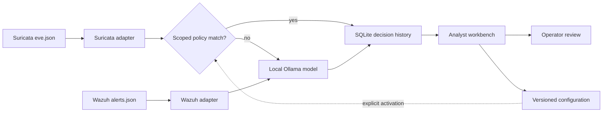

<p align="center">
  
</p>

# TriageWall

> Local-first AI alert triage for Suricata and Wazuh.
> Reduce security noise without sending telemetry to the cloud.

[](https://github.com/aaronphifer/triagewall/releases/latest)
[](https://github.com/aaronphifer/triagewall/actions/workflows/regression.yml)
[](https://github.com/aaronphifer/triagewall/actions/workflows/codeql.yml)
[](LICENSE)
[](https://github.com/aaronphifer/triagewall/stargazers)
[](https://github.com/sponsors/aaronphifer)

[Get started](#five-minute-demo) · [Documentation](#documentation) · [Latest release](https://github.com/aaronphifer/triagewall/releases/latest)



<p align="center">
  <strong>99%+ typical policy resolution after tuning</strong> ·
  <strong>100% local with no alert telemetry</strong> ·
  <strong>266-alert approved release evaluation</strong>
</p>

## Why TriageWall?

Suricata and Wazuh are excellent sensors, but high-volume alerts still leave an
operator with a prioritization problem. TriageWall adds a local decision layer:
validated deterministic policy handles known repeat noise, a local security
model reviews the long tail, and a source-aware workbench keeps the final
decision with the operator.

TriageWall is built for self-hosted security teams, homelab operators, and
small environments that want useful triage without uploading alert evidence to
a cloud model. It reads from your sensors and records decisions; it does not
block traffic, change sensor rules, or take autonomous response actions.

## Product capabilities

- **One review queue for Suricata and Wazuh.** Preserve source, event, rule,
  agent, and network context instead of flattening every sensor into one shape.
- **Two-tier local classification.** Resolve carefully scoped repeat noise in
  microseconds and send only the residual long tail to a local Ollama model.
- **Analyst investigation views.** Review recurrence, related activity,
  source-specific evidence, and queue-aware Previous/Next navigation.
- **Bounded alert search.** Find retained alerts by signature, exact IP address,
  or historical asset hostname without allowing an absent term to scan an
  unbounded production database.
- **Versioned operator configuration.** Draft, validate, preview, activate, and
  roll back prefilter and private asset revisions with optimistic locking,
  attribution, and audit history.
- **Evidence-driven releases.** Regression CI, CodeQL, deterministic gold-set
  gates, documented threat boundaries, and production release evidence are
  part of the release process.

## See the workflow

The 20-second demo uses sanitized fixture data from v0.4. Addresses are masked,
feedback is disabled, and no production telemetry is shown.



## Measured results

| Signal | Measured result | Scope |
|---|---:|---|
| Deterministic policy resolution | 99%+ typical after site tuning | Production-shaped Suricata workloads; workload-dependent |
| Source rate | 6,000–13,000 alerts/hour | Long-running homelab deployment |
| v0.3 end-to-end accuracy | 99.624% | Approved 266-alert operator evaluation |
| v0.3 end-to-end true-positive recall | 100% | Same approved evaluation |
| Local-model latency | 7–10 seconds per residual alert | Foundation-Sec-8B Q5_K_M on RTX 4060 |

The evaluation is versioned and reproducible. Read the
[gold-set methodology](docs/gold-set-gate.md), the
[v0.3 release evidence](docs/release-evidence-v0.3.md), and the
[model experiment notes](docs/experiments/). TriageWall does not present these
numbers as guarantees for every network or model.

## Five-minute demo

### Requirements

- Docker Engine 20.10+ and Docker Compose v2
- Ollama on the same host or another reachable private host
- 8 GB+ GPU VRAM recommended for the default residual-alert model

```bash
git clone https://github.com/aaronphifer/triagewall.git
cd triagewall
cp .env.example .env
```

On the Ollama host, pull the default model before starting TriageWall:

```bash
ollama pull hf.co/gabriellarson/Foundation-Sec-8B-Instruct-GGUF:Q5_K_M
```

Set `DEMO_MODE=true` in `.env`, then start the stack:

```bash
docker compose up -d
```

Open [http://localhost:8084](http://localhost:8084). Demo mode uses bundled
fixtures, masks addresses, and disables writes so you can inspect the workflow
before connecting a sensor.

For a real deployment, set `DEMO_MODE=false` and configure the Suricata data
path, persistent data directory, Ollama host/model, and internal networks in
`.env`. The [operations guide](docs/operations.md) covers the complete setup,
database startup, storage, retention, model selection, and tuning workflow.

### Optional Wazuh connection

The opt-in `docker-compose.wazuh.yml` profile reads a same-host Wazuh manager's
`alerts.json` from a local read-only volume. It uses no Wazuh API credential and
receives no Docker socket. See the
[Wazuh integration guide](docs/wazuh-integration.md) for startup, archive
recovery, verification, and rollback.

### Configuration workspace

Configuration writes are disabled by default and require an attributable
`config:write` API key. Generate one from a private terminal:

```bash
python scripts/generate_api_key.py
```

Store the generated hash-only record in `.env`, retain the one-time plaintext
key, set `TRIAGEWALL_CONFIG_WRITES_ENABLED=true`, and restart the dashboard.
The [API authentication guide](docs/api.md#configuring-a-key) documents scopes
and deployment boundaries.

## Architecture



TriageWall Core is the supported operational product. A future TriageWall Lab
will provide isolated replay and evaluation without weakening Core's production
boundary. Read the [Core/Lab product boundary](docs/core-lab-product-boundary.md).

## Security and privacy promises

- Alert evidence and model inference stay on operator-controlled hardware.
- Sensor records are treated as untrusted input and projected through
  source-specific isolation before local-model evaluation.
- The application is read-only with respect to Suricata and Wazuh.
- Configuration mutation is default-off, API-key-only, attributable, audited,
  previewed, and explicitly activated.
- Database migration has one startup owner; consumers fail closed on incomplete
  or invalid schema/configuration state.
- Release gates cover deterministic behavior, configuration lifecycle,
  authorization, browser concurrency, checkpoints, and source-specific
  regressions.

Read [SECURITY.md](SECURITY.md) before reporting a vulnerability and
[the threat model](docs/THREAT_MODEL.md) for defended boundaries, assumptions,
and known limitations.

## Supported integrations

| Integration | Status | Notes |
|---|---|---|
| Suricata `eve.json` | Core | Durable checkpoints and fail-closed rotation recovery |
| Wazuh `alerts.json` | Optional | Local read-only volume and source-aware projection |
| Ollama | Core | Local inference; no cloud-model dependency |
| SQLite | Core | WAL-backed decision, feedback, configuration, and audit history |
| Docker Compose v2 | Supported deployment | Core-only and optional Core + Wazuh profiles |

## Documentation

- [Operations and deployment](docs/operations.md)
- [Wazuh integration](docs/wazuh-integration.md)
- [HTTP API and authentication](docs/api.md)
- [Operator configuration lifecycle](docs/operator-configuration-foundation.md)
- [Threat model](docs/THREAT_MODEL.md)
- [Gold-set release gate](docs/gold-set-gate.md)
- [Release evidence](docs/release-evidence-v0.4.md)
- [Model and security experiments](docs/experiments/)
- [Product roadmap](ROADMAP.md)
- [Changelog](CHANGELOG.md)

## What TriageWall does not do

- It does not block traffic or invoke active response.
- It does not replace Suricata, Wazuh, a firewall, or an endpoint agent.
- It does not make every alert correct; uncertain and false-negative outcomes
  remain possible and the operator stays in the loop.
- It does not provide cloud identity, multi-tenant authorization, or an
  internet-facing SaaS control plane.

## Community and support

Bug reports and feature requests use the repository's structured
[issue forms](https://github.com/aaronphifer/triagewall/issues/new/choose).
Use [GitHub Discussions](https://github.com/aaronphifer/triagewall/discussions)
for questions and implementation ideas. Read [SUPPORT.md](SUPPORT.md) for the
support boundary and [CONTRIBUTING.md](CONTRIBUTING.md) before opening a pull
request.

## Support TriageWall

If TriageWall is useful to you, [GitHub Sponsors](https://github.com/sponsors/aaronphifer)
helps fund release validation, testing hardware, local-model evaluation, and
documentation. Sponsorship does not change the open-source license or replace
commercial licensing.

## License

TriageWall is licensed under [AGPL-3.0](LICENSE). Commercial licenses are
available for organizations that need to ship TriageWall without AGPL section
13 compliance; contact `licensing@triagewall.io`.

Built with [Suricata](https://suricata.io), [Wazuh](https://wazuh.com),
[Ollama](https://ollama.com), [FastAPI](https://fastapi.tiangolo.com), and the
self-hosted security community.
