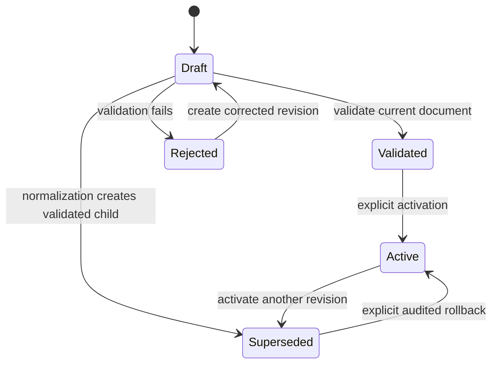

# Operator configuration foundation

Status: Accepted; implementation in progress for v0.4

## Purpose

TriageWall needs operator-managed prefilter and asset configuration without
turning the analyst dashboard into an unaudited file editor. This design adds a
versioned configuration lifecycle before any prefilter or asset editor is
exposed.

The foundation must preserve these properties:

- shipped defaults remain immutable and identifiable;
- configuration changes never take effect merely because a draft was saved;
- the exact principal, revision, validation result, and activation decision are
  attributable;
- one event is classified against one immutable configuration bundle;
- a malformed, conflicting, or unreadable revision never replaces the last
  known good bundle;
- rollback is a normal audited activation, not a file restore or database edit;
- historical verdict context is not rewritten when configuration changes;
- Core remains useful without Lab and no Lab process receives live Core access.

## Current state

The current implementation is safe but intentionally static:

- `triagewall/config/prefilter.json` is mounted read-only into Suricata ingest.
- The private asset inventory is mounted read-only into both ingest services.
- `triage.py` validates both documents and loads them into process globals once
  at startup.
- Invalid documents fail process startup rather than silently broadening a
  suppression or dropping asset context.
- The dashboard can write operator feedback to the shared SQLite database, but
  it does not mount either configuration file.
- The dashboard write cookie proves same-origin provenance only. It does not
  identify an operator and grants only feedback capability.
- Asset snapshots preserve the inventory revision for matched assets. The
  effective prefilter revision and the inventory revision for unmatched events
  are not yet persisted as first-class decision provenance.

These boundaries rule out direct dashboard edits to the mounted JSON files.
They also make SQLite the existing durable coordination boundary shared by the
dashboard, Suricata ingest, Wazuh ingest, migrations, backup, and rollback.

## Decision

Store canonical, immutable operator revisions and the active configuration
pointer in the Core SQLite database. Keep repository defaults as read-only
bootstrap inputs. During the persistence-only compatibility slice, mirror the
mounted runtime inputs into durable state at every startup. After runtime
cutover, do not rewrite or depend on mutable mounted files as behavioural
inputs.

The first release manages two complete document kinds:

- `prefilter_policy`
- `asset_inventory`

An operator revision is a complete effective document, not a collection of
partially merged rule fragments. It records the digest of the shipped base from
which it was created. A future release may add structured overlay merging after
stable rule identities and upgrade semantics exist; v0.4 will not invent those
semantics implicitly.

This gives shipped and operator configuration separate ownership:

- shipped defaults remain in the image and provide a deterministic bootstrap;
- operator revisions are durable, attributable, exportable, and rollbackable;
- a software upgrade never silently merges new shipped defaults into an active
  operator revision;
- the UI can offer an explicit rebase or comparison when the shipped base
  digest changes.

## Durable model

The migration owner creates three tables under its existing serialized
`BEGIN IMMEDIATE` phase.

### `operator_config_revisions`

One immutable canonical document:

| Field | Contract |
|---|---|
| `id` | Integer primary key |
| `kind` | `prefilter_policy` or `asset_inventory` |
| `revision` | SHA-256 of the immutable stored JSON document |
| `document_json` | Canonically encoded JSON; validated/active rows are normalized effective documents; maximum 1 MiB |
| `source` | `shipped`, `operator_import`, or `operator` |
| `parent_revision_id` | Revision from which an operator draft was created |
| `shipped_base_revision` | Digest of the repository default used as its base |
| `state` | `draft`, `validated`, `active`, `superseded`, or `rejected` |
| `validation_json` | Bounded machine-readable validation and preview summary |
| `created_at` / `created_by` | UTC timestamp and attributable API-key principal |
| `note` | Optional bounded operator rationale |

Documents are append-only. State transitions may update lifecycle metadata,
but document content and its digest never change.

### `operator_config_state`

One singleton row names the complete active bundle:

| Field | Contract |
|---|---|
| `id` | Constant singleton primary key |
| `active_prefilter_revision_id` | Current validated prefilter revision |
| `active_asset_revision_id` | Current validated asset revision |
| `previous_prefilter_revision_id` | Previous prefilter rollback target |
| `previous_asset_revision_id` | Previous asset rollback target |
| `mode` | `legacy` while mounts are authoritative; `database` after runtime cutover |
| `generation` | Monotonic integer incremented by every activation |
| `updated_at` | UTC activation timestamp |

Activation updates the required pointer or pointers and the bundle generation
in one transaction, so an event cannot observe half of a multi-document change.

### `operator_config_audit`

An append-only record of draft creation, validation, preview, activation,
conflict, rejection, rollback, export, and reload failure. Each row records the
UTC timestamp, configuration kind, revision IDs, actor, authentication method,
request identifier, action, and bounded structured detail.

Secrets, API keys, the process canary, and unrestricted sensor records are
never configuration content or audit detail.

### `operator_config_consumers`

One bounded heartbeat row per enabled ingest consumer records its loaded and
desired generation, loaded revision pair, last successful load time, latest
check time, and `ok` or `error` status. Errors are generic and bounded; this
table never contains configuration documents or sensor records. A missing row
means that optional consumer has not started, not that it is healthy.

## Lifecycle

1. **Bootstrap.** When no database state exists, one serialized bootstrap owner
   validates the packaged default, the legacy mounted prefilter, and the mounted
   private inventory. It imports the packaged default as `shipped` and the
   current effective legacy documents as `operator_import` revisions. It does
   not copy private inventory content into logs. Until runtime cutover, every
   later startup -- the one-shot bootstrap and each ingest consumer start, which
   restart independently -- validates and mirrors changed mounted inputs as a
   new active generation through the same serialized transaction, so database
   state cannot diverge from actual ingest behaviour. Each consumer publishes
   the exact objects that synchronization validated, so one read of each mount
   backs both the durable revision and the runtime bundle.
2. **Draft.** An attributable operator submits a complete candidate based on a
   named active revision and generation.
3. **Validate.** Core runs the existing strict parser, canonicalization, size,
   item-count, duplicate, CIDR, asset, and prompt-context limits. A candidate
   already in canonical form transitions in place. If normalization changes
   the document, Core preserves the submitted draft and creates a canonical
   validated child. Validation creates no active behaviour.
4. **Preview.** Core compares the validated candidate with the active document
   over a bounded recent sample. Preview is read-only and never calls the model.
5. **Activate.** The operator supplies the expected generation and explicitly
   confirms the validated revision. Core revalidates it inside the activation
   path, updates the active pointer, and appends the audit event atomically.
6. **Reload.** Ingest observes the new generation between records, builds a
   complete immutable configuration bundle, and swaps it in one assignment.
7. **Rollback.** The operator activates a prior validated revision through the
   same authorization, optimistic-lock, validation, and audit path.

## Optimistic locking and activation

Every draft records its parent revision and shipped-base digest. Mutating API
requests require the current bundle generation, represented through an
`If-Match` validator or an equivalent required field.

Activation returns `409 Conflict` when:

- another operator activated a revision after the draft was created;
- the expected generation is stale;
- the shipped base changed and the candidate was not explicitly reviewed
  against it; or
- the revision is no longer in a validated state.

Activation uses one short SQLite transaction. It never waits for model work,
historical preview, file I/O, or ingest acknowledgement while holding the write
lock.

## Runtime reload and last-known-good behaviour

Suricata and Wazuh ingest each hold an immutable `ConfigurationBundle` with:

- bundle generation;
- prefilter policy and revision;
- asset inventory and revision;
- shipped-base digests;
- load timestamp.

The process checks the database generation at a bounded interval and only
between event records. When it changes, the process reads both active documents
in one read transaction, validates them with the same production parsers, and
constructs the replacement bundle before publishing it.

If reading or validation fails:

- the process keeps its previous in-memory bundle;
- the durable active pointer is not modified by the consumer;
- health reports the desired generation, loaded generation, error, and age;
- an audit/operational event records the bounded failure without document
  content;
- repeated retries use bounded backoff.

On first startup there is no in-memory fallback. A missing or corrupt active
bundle fails startup closed, just as invalid mounted configuration does today.

## Bootstrap and upgrade compatibility

The current Compose path bind-mounts `triagewall/config/prefilter.json` over the
same image path and mounts the private inventory only into ingest. v0.4 must not
mistake a locally edited legacy prefilter for a new shipped default or let two
long-running consumers race to import configuration.

The first persistence slice therefore adds a serialized one-shot bootstrap
phase after schema migration and before dashboard or ingest startup:

- package an immutable default policy at a path that no operator mount covers;
- mount the legacy effective prefilter and private asset inventory read-only
  into the bootstrap owner;
- import the packaged default as `shipped`;
- import a differing legacy prefilter and the private inventory as
  `operator_import`;
- create the singleton active bundle and generation atomically;
- initialize it in `legacy` mode and, on every later start of the bootstrap
  owner or of either ingest consumer, atomically mirror any valid change to
  either mounted effective document;
- make dashboard, Suricata ingest, and optional Wazuh ingest depend on successful
  bootstrap completion.

In `legacy` mode, invalid mounted configuration fails bootstrap closed because
those files are still what ingest will load. A packaged-default change is
recorded independently as a shipped revision; it affects the active bundle only
when the mounted effective policy also changes. This preserves existing upgrade
and rollback behaviour while making the durable record truthful.

The runtime-cutover slice atomically changes the singleton to `database` mode
when activation and hot reload are ready. In that mode bootstrap ignores legacy
mount changes, new packaged defaults never replace active operator pointers,
and long-running processes load the complete durable bundle. The mounts then
remain only for explicit compatibility import until a later removal and
rollback plan covers them.

## Decision provenance

Each persisted verdict must record the configuration bundle generation and the
effective prefilter and asset inventory revisions. This includes:

- Suricata alerts that match no asset;
- Suricata alerts that do not match a prefilter rule;
- deterministic prefilter verdicts;
- Wazuh verdicts, even though Wazuh does not use the Suricata prefilter.

Existing immutable asset snapshots remain unchanged. The new provenance names
which complete bundle was evaluated; snapshots preserve the exact matched
asset values used in the prompt.

## Authorization boundary

Add `config:write` as a valid API-key scope. Configuration endpoints require an
API key carrying that scope for both reads and writes because documents may
contain private asset inventory and suppression policy.

The following do **not** grant configuration access:

- anonymous reads;
- the ordinary `read` scope;
- the `feedback:write` scope;
- the same-origin dashboard feedback cookie;
- demo mode.

Mutation is disabled unless `TRIAGEWALL_CONFIG_WRITES_ENABLED=true`. Enabling
the flag without at least one configured `config:write` API key fails startup.
The first UI editor must keep any supplied credential in memory only; it must
not place it in URLs, logs, persistent browser storage, or the database.

## API surface

The initial API is deliberately lifecycle-oriented:

- `GET /api/v1/config` — active kinds, revisions, generation, and reload health
- `GET /api/v1/config/{kind}` — active canonical document and metadata
- `GET /api/v1/config/{kind}/revisions` — bounded metadata-only revision list
- `GET /api/v1/config/{kind}/revisions/{id}` — one immutable revision document
- `POST /api/v1/config/{kind}/drafts` — create an immutable draft
- `POST /api/v1/config/{kind}/drafts/{id}/validate` — validate and canonicalize
- `POST /api/v1/config/{kind}/drafts/{id}/preview` — bounded impact comparison
- `POST /api/v1/config/{kind}/drafts/{id}/activate` — explicit atomic activation
- `POST /api/v1/config/{kind}/revisions/{id}/rollback` — activate prior revision
- `GET /api/v1/config/audit` — bounded cursor-paginated audit history

No generic filesystem path, environment variable, SQL, model, URL, or command
field is accepted from configuration content.

## Bounded impact preview

Preview operates on at most a configured maximum of the newest eligible events
inside a capped time window and reports `candidate_limit`,
`candidates_examined`, and `truncated`.

For prefilter candidates it reports:

- newly suppressed and no-longer-suppressed counts;
- unchanged match counts;
- affected signature IDs and bounded example event IDs;
- rules with no sampled matches;
- broad or unscoped rules requiring an explicit warning acknowledgement.

For asset inventory candidates it reports:

- addresses newly matched, no longer matched, or matched to changed context;
- affected bounded example event IDs;
- duplicate ownership and context-size failures from validation.

Preview does not rerun Ollama, alter verdicts, modify checkpoints, or claim
full-history completeness when truncated.

## Delivery slices

### Slice 1 — persistence and bootstrap

Status: implemented.

- Add the three configuration tables and fail-closed migration verification.
- Add the serialized one-shot bootstrap owner and its read-only legacy mounts.
- Canonicalize/import packaged, legacy prefilter, and private asset documents
  without logging private content.
- Keep the durable active bundle synchronized with mounted runtime inputs while
  the singleton is in explicit `legacy` compatibility mode.
- Add unit coverage for immutable revisions, digests, and bootstrap idempotency.

### Slice 2 — authorization and draft lifecycle

Status: implemented.

- Add `config:write` and the default-off mutation flag.
- Add create, validate, list, and audit endpoints.
- Prove that anonymous, read, feedback, cookie, and demo callers cannot access
  configuration documents.

### Slice 3 — preview and activation

Status: implemented.

- Add bounded prefilter and asset previews.
- Add generation-based conflict handling and atomic activation.
- Keep activation coupled to the generation-aware runtime owner delivered in
  Slice 4; the first activation atomically cuts authority over to `database`.
- Persist and startup-verify decision bundle provenance for both sensor paths.

### Slice 4 — hot reload and rollback

Status: implemented.

- Replace process-global configuration objects with an immutable bundle owner.
- Add bounded reload checks to both ingest paths.
- Prove last-known-good retention, health reporting, restart behaviour, and
  audited rollback.

### Slice 5 — editors and release hardening

Status: implemented.

- Build the prefilter and asset editors on the proven lifecycle API.
- Cover authorization, audit, concurrency, activation, reload, rollback,
  redaction, both sensors, browser behaviour, and production-shaped timing.

The routed `/configuration` workspace keeps its dedicated administrator key in
memory only and sends it exclusively as `X-API-Key`. It never places the key in
URLs, request bodies, logs, browser storage, or the TriageWall database. The
workspace exposes the exact canonical candidate, immutable draft creation,
validation, bounded preview, broad-rule and shipped-base warnings, explicit
activation, revision history, rollback, audit history, and consumer reload
health. Alert-detail actions can seed a scoped Suricata rule or exact-IP asset
record without carrying evidence or credentials in route state.

## Non-goals for the foundation

- Automatic suppression, tuning, activation, promotion, or rollback
- Editing prompts, models, API keys, secrets, paths, or sensor settings
- Applying a candidate retroactively to stored operational verdicts
- Letting Lab mount or mutate the Core database
- Treating a preview sample as complete when it was truncated
- Replacing the existing strict prefilter and asset validators
